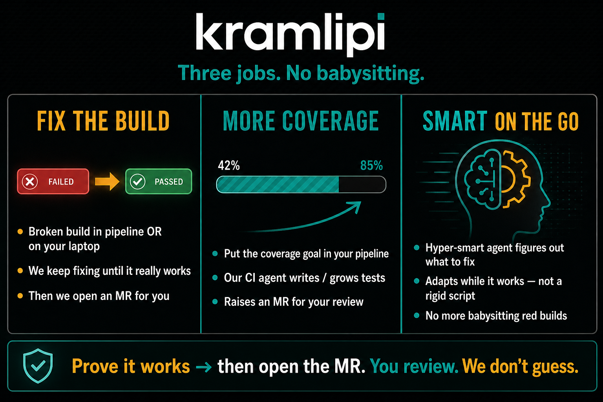
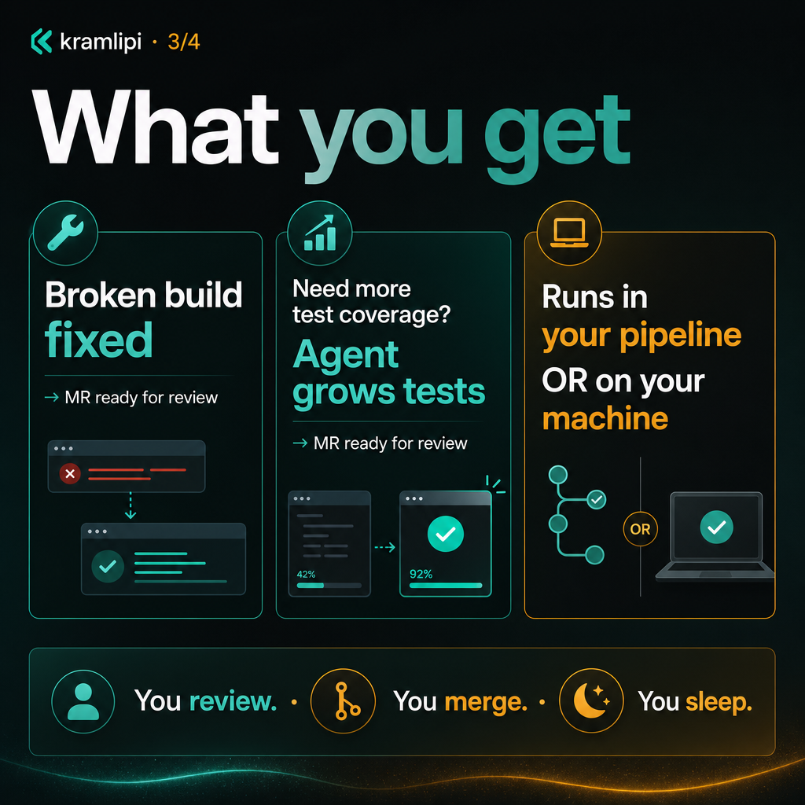

# Get started

# KramLipi Code agent

**Increase your code coverage and review automatically.**

Developers ship code faster — but unit tests and failed builds pile up.
This agent fixes that in the **CI pipeline** (and locally).

**This is the only start page** (Quick Start merged here).

## How kramlipi helps (collage)

<div class="kl-collage-hero" markdown="0">
  
</div>

<div class="kl-collage" markdown="0">
  <a href="assets/kramlipi-social-01-pain.png"></a>
  <a href="assets/kramlipi-social-02-how.png"></a>
  <a href="assets/kramlipi-social-03-customer.png"></a>
  <a href="assets/kramlipi-social-04-punch.png"></a>
</div>

**Story in four panels:** pain → how it helps → what you get → no babysitting.  
Share the same images on LinkedIn / X (captions in the product repo `docs/SOCIAL-COLLAGE-SERIES.md`).

---

## 1. Binary first

**[Google Drive](https://drive.google.com/drive/folders/11iuNWM13SjrlKastaA_2FaMz4tGg9_QX?usp=sharing)** — `linux/` · `macos/` · `windows/`

Also: [GitHub Releases](https://github.com/kramlipi/code-agent-binaries/releases)

```bash
chmod +x code-agent   # Linux / macOS
# Windows: use code-agent.exe
```

## 2. ENV (pick a model + API key)

Set **`CODE_AGENT_MODEL`** (LiteLLM string) and the matching provider key.

#### Gemini (default / recommended)

Key: [Google AI Studio](https://aistudio.google.com/)

```bash
export CODE_AGENT_MODEL=gemini/gemini-3.1-flash-lite
# also fine: gemini/gemini-2.0-flash
export GEMINI_API_KEY=YOUR_SECRET_KEY
```

**PowerShell (Windows):**

```powershell
$env:CODE_AGENT_MODEL="gemini/gemini-3.1-flash-lite"
$env:GEMINI_API_KEY="YOUR_SECRET_KEY"
```

#### Claude

```bash
export CODE_AGENT_MODEL=anthropic/claude-sonnet-4-20250514
export ANTHROPIC_API_KEY=YOUR_SECRET_KEY
```

Key: [Anthropic Console](https://console.anthropic.com/)

#### OpenAI

```bash
export CODE_AGENT_MODEL=openai/gpt-4o
export OPENAI_API_KEY=YOUR_SECRET_KEY
```

Release binaries: Free activates on the first metered run. Set `CODE_AGENT_LICENSE_KEY` for Team/Business.

#### Cursor?

No public Cursor model API for `code-agent` — use Gemini / Claude / OpenAI. Full list: [Quick Start](quick-start.md#2-env-pick-a-model-api-key).

#### Other providers (optional)

```bash
export CODE_AGENT_MODEL=deepseek/deepseek-chat
export DEEPSEEK_API_KEY=YOUR_SECRET_KEY

export CODE_AGENT_MODEL=openrouter/anthropic/claude-3.5-sonnet
export OPENROUTER_API_KEY=YOUR_SECRET_KEY

export CODE_AGENT_MODEL=openai/my-model
export CODE_AGENT_API_BASE=https://your-proxy.example/v1
export CODE_AGENT_API_KEY=YOUR_PROXY_KEY
```

| Variable | Required when |
|----------|---------------|
| `CODE_AGENT_MODEL` | Always (or config default) |
| `GEMINI_API_KEY` | `gemini/…` |
| `ANTHROPIC_API_KEY` | `anthropic/…` |
| `OPENAI_API_KEY` | `openai/…` |
| `CODE_AGENT_ECONOMY_MODE` | Optional — `true` to save cost (default **off**) |

## 3. What do you want to do?

### Increase code coverage

**Pain:** Coverage / missing tests block merge.

```bash
code-agent run "increase unit test coverage" \
  -w /path/to/your-repo \
  --verify-cmd "go test ./..."
```

→ [Use cases → Coverage](use-cases.md#4-coverage-gate-blocking-merge) · [Features → Coverage](features.md#coverage)

### Fix a broken build

**Pain:** CI red; log archaeology at midnight.

```bash
go test ./... 2>&1 | tee /tmp/ci.log

code-agent experts run bug-fix \
  --log /tmp/ci.log \
  --verify-cmd "go test ./..." \
  -w /path/to/your-repo
```

→ [Use cases → Fix CI](use-cases.md#1-ci-failed--you-need-a-fix-tonight) · [Python](use-cases.md#python-example) · [Go](use-cases.md#go-example) · [Java](use-cases.md#java-example)

### Review a PR (inline comments)

**Pain:** No first-pass review on every PR.

```bash
code-agent experts run code-review --pr 42 -w /path/to/your-repo
code-agent experts run code-review --pr 42 --dry-run -w /path/to/your-repo
```

**CI copy-paste (GitHub / GitLab / Azure):** [Code review CI](code-review-ci.md)

Economy mode is **off by default**. Opt in: `CODE_AGENT_ECONOMY_MODE=true`.

```bash
git diff main...HEAD > /tmp/mr.diff
code-agent experts run code-review --diff-file /tmp/mr.diff -w .
```

→ [Use cases](use-cases.md#9-automated-pr-line-comments-code-review) · [Features → code-review](features.md#experts)

### Other features

| I want to… | Command | Detail |
|------------|---------|--------|
| Impacted tests only | `experts run test-intel --pr N` | [Use cases → test-intel](use-cases.md#2-slow-ci--stop-running-the-full-suite) |
| Babysit PR | `experts watch --pr N --verify-cmd "…"` | [Use cases → watch](use-cases.md#51-same-pr-keeps-failing--babysit-until-green) |
| Missing metrics | `experts run monitoring-expert --dry-run` | [Features → experts](features.md#experts) |
| Alert → fix | `experts run sre-expert --log alert.json` | [Use cases → SRE](use-cases.md#7-sre-and-incidents) |

| Flag | Meaning |
|------|---------|
| `-w` | Repo path |
| `--verify-cmd` | Must exit `0` |

**Rule:** success = verify exits `0`, not model opinion.

---

## 4. Docker (optional)

### Quick `docker run`

```bash
docker pull ghcr.io/kramlipi/code-agent:latest

docker run --rm -it \
  -e CODE_AGENT_MODEL \
  -e GEMINI_API_KEY \
  -v "/path/to/your-repo:/workspace" \
  ghcr.io/kramlipi/code-agent:latest \
  run "increase unit test coverage" \
  --verify-cmd "go test ./..." \
  -w /workspace
```

### Browser UI (~60 seconds)

```bash
export GEMINI_API_KEY=your-key
curl -fsSL -o docker-ui.sh \
  https://gist.githubusercontent.com/kramlipi/d31f4f454cd127cfb552e5ed5e854af3/raw
chmod +x docker-ui.sh
bash docker-ui.sh
# → http://127.0.0.1:8080
```

Windows gist: [docker-ui.ps1](https://gist.github.com/kramlipi/387228f78eb47e437f578f625a101707)

---

## Pricing (adoption + revenue)

| Plan | Price | You get |
|------|-------|---------|
| **Community (Free)** | $0 | Prove green verify locally; capped runs; 14-day commercial eval |
| **Team — CI Repair** | **$49/mo** | Commercial CI rights, higher caps, ~5 seats |
| **Business — PR Babysit** | **$199/mo** | + `experts watch`, more seats/volume |

Contact / keys: **cluevion@gmail.com**

### How to run (three modes)

| Mode | When |
|------|------|
| **Local binary** | Laptop fix / coverage / dry-run review |
| **CI (Actions / GHCR)** | Every PR or failed workflow — `ghcr.io/kramlipi/code-agent` or binary on runner |
| **Local UI** | Browser demo — Docker UI gist above |

### Enterprise trust (short)

Runs on **your** machine or **your** CI with **your** LLM key. We don’t host your monorepo.

---

## Exit codes

| Code | Meaning |
|------|---------|
| `0` | Success |
| `1` | Config / startup / doctor failure |
| `2` | Agent ran but task or verify failed |

---

## Next

| | |
|-|-|
| Pain → command | [Use cases](use-cases.md) · [Pains catalog](use-cases.md#pains-catalog) |
| All flags & experts | [Features](features.md) |
| Home | [index](index.md) |
